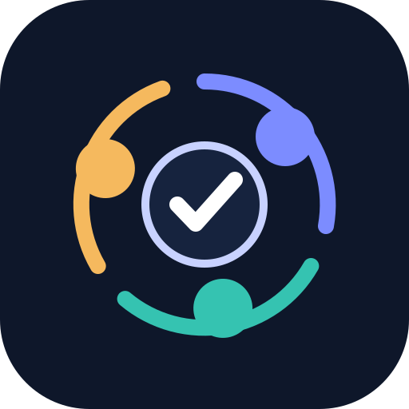

# Triad+

<p align="center">
  
</p>

Triad+ is a lightweight, evidence-backed engineering method for a coding-agent host.
It keeps the normal loop deliberately small:

```text
Orchestrator
  ├─ Developer
  └─ Reviewer
```

The Orchestrator maintains the goal and chooses the next step. The Developer
changes the artifact. The Reviewer examines the verified result and returns
`approved`, `rework`, or `blocked`. The host agent, not Triad+, governs that
conversation and those decisions.

After approval, an optional **Evaluator+** may make a fresh, independent
post-run assessment. Its `PASS`, `FAIL`, or `INDETERMINATE` report never changes
the completed Triad decision and never starts repair automatically.

- [Operating guide](docs/operating-guide.md) and [Italian guide](docs/operating-guide.it.md)
- [Installation and setup](docs/npx-installation.md)
- [Compatibility matrix](docs/compatibility.md)
- [Evaluator+ contract](docs/evaluator-plus.md)
- Adapter notes: [Codex](docs/codex-replication.md), [OpenCode](docs/opencode-replication.md), [Claude Code](docs/claude-code-replication.md), [Antigravity](docs/antigravity-replication.md), [Hermes](adapters/hermes/README.md)

`runtime/triad-verify.mjs` is infrastructure, not an orchestrator. It runs
declared `control-plane` quality gates deterministically and writes atomic,
environment-derived evidence bound to the assignment, worktree, branch, and
candidate fingerprint. Agent statements about tests are claims; verifier output
is the authoritative observation.

## Quick start

```bash
npx triad-plus init --host codex --control /path/to/project-control --global
npx triad-plus doctor --host codex --control /path/to/project-control
```

Open the control workspace in the chosen host and use its native Triad command:
`/prompts:triad` in Codex, `/triad` in OpenCode, Claude Code, Antigravity, and
Hermes.

Triad+ supports Codex, OpenCode, Claude Code, Antigravity, and Hermes through a
small adapter contract. See the installation guide before placing a control
workspace inside any product repository.

## License

MIT. See [LICENSE](LICENSE).
