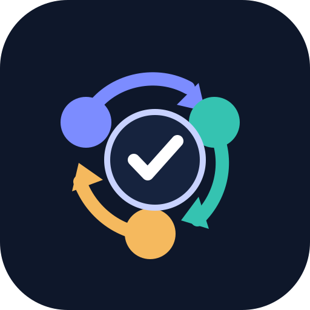

# Triad Engineering Loop

  

Triad Engineering Loop is an evidence-driven delivery method for one
orchestrator, one developer, one fresh quality evaluator when needed, and one
independent reviewer. It separates project control records from product source
code and keeps human intervention limited to real product decisions.

- [Operating guide](docs/operating-guide.md) explains the method for people.
- [Guida operativa italiana](docs/operating-guide.it.md) is the complete Italian localization.
- [Codex replication guide](docs/codex-replication.md) explains the installable
  Codex adapter and its native `/prompts:triad` command.
- [OpenCode replication guide](docs/opencode-replication.md) explains the
  installable OpenCode adapter and its `/triad` command.
- [Claude Code replication guide](docs/claude-code-replication.md) explains the
  installable Claude Code adapter and its `/triad` command.
- [Gauntlet evolution](docs/gauntlet-evolution.md) explains the optional
  quality-optimization loop and its external verification control plane.
- `skills/` contains the five standard Agent Skills that implement the method.
- `adapters/` contains Codex, OpenCode, and Claude Code adapters with
  collision-safe installers for the same skills.
- `runtime/`, `schemas/`, and `integrations/codex/` contain the host-agnostic
  verification runner, formal evidence contracts, and the version-gated Codex
  lifecycle-hook adapter.

The method does not require a particular organization, repository host, or
product stack. The examples use Git, a private project-control repository, and
local worktrees because they provide reproducible evidence and safe isolation.
