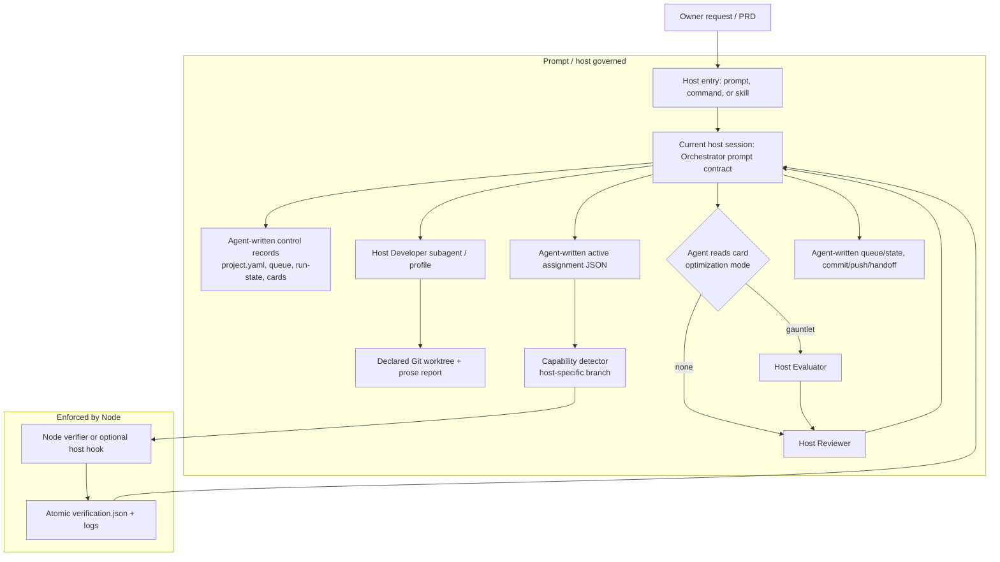

# TRIAD — Current State Audit

## Audit basis and limits

- **Repository:** `triad-plus-engineering-loop`
- **Baseline commit:** `86b43a057f4bccae238ac336b8aba7170cf86f06`
- **Audit date:** 2026-08-24
- **Method:** static inspection of all 78 tracked files and their call/reference
  relationships. The existing automated tests were deliberately **not rerun**:
  this audit reports their source coverage, not a fresh claim that a loop works.
- **Scope:** the repository only. A deployed control workspace, a host's live
  configuration, and any historical project artifacts are not part of this
  evidence.

“Implemented” below means that repository code enforces or produces the
behavior. “Prompt contract” means that an agent is instructed to do it; it is
not automatically enforced by this repository.

## 1. Executive summary

Triad today is an **instruction-led delivery method with a small executable
verification control plane**, packaged with host-specific installation assets.
It is not an executable orchestration engine.

The executable parts are deliberately narrow:

1. `bin/triad-plus.js` installs assets and writes an optional team file.
2. `runtime/triad-runtime-capabilities.mjs` detects a host binary and selects a
   verification-dispatch mode.
3. `runtime/triad-verify.mjs` validates a pre-written developer assignment,
   executes hashed `control-plane` gates, fingerprints the worktree, and writes
   atomic verification evidence.

All of the following are currently performed by a host agent following skills
and adapter prompts rather than by a program: bootstrap, PRD copying/hashing,
feature decomposition, queue mutation, assignment creation, state transitions,
evidence acceptance, evaluator dispatch, reviewer dispatch, retry limits,
arbitration, commits, pushes, delivery, demos, and human escalation.

Consequently, Triad has two different kinds of authority:

- **hard authority:** the Node verifier can reject an invalid assignment or a
  failed/changed candidate, and its `verification.json` is environment-derived;
- **soft authority:** the Orchestrator is asked to enforce the method, but its
  state changes and decisions are prose/file edits without a state-machine
  runtime that validates them.

The repository already contains four conceptual roles—Orchestrator, Developer,
Evaluator, Reviewer—even though the normal feature-card template defaults to
`optimization.mode: none`. The Evaluator and quality-loop artifacts are present
in the current implementation; they are prompt/schema-driven and have no
dedicated executable dispatcher or result validator.

## 2. Repository architecture

```text
triad-plus-engineering-loop/
├── bin/
│   └── triad-plus.js                 # Node installer and read-only doctor
├── skills/                           # five host-neutral instruction contracts
│   ├── triad-loop-bootstrap/
│   │   └── assets/                   # project/.loop templates
│   ├── triad-loop-orchestrator/
│   ├── triad-loop-developer/
│   ├── triad-loop-evaluator/
│   └── triad-loop-reviewer/
├── runtime/
│   ├── triad-runtime-capabilities.mjs
│   ├── triad-verify.mjs
│   └── lib/                          # gate, process, evidence, fingerprint helpers
├── schemas/                          # JSON Schemas; not executed by the runtime
├── adapters/
│   ├── codex/                        # global prompt + Bash installer
│   ├── opencode/                     # agents, /triad command, installer
│   ├── claude-code/                  # subagents, /triad command, installer
│   └── antigravity/                  # agents, /triad skill wrapper, installer
├── integrations/
│   ├── codex/hooks.json              # inactive configuration fragment
│   └── claude-code/hooks.json        # inactive configuration fragment
├── docs/                             # operating, install, and host guides
├── tests/                            # installer and Node-control-plane tests
├── assets/                           # repository icon
└── package.json                      # npm package metadata; no runtime dependencies
```

### Entry points

| Entry point | Actual responsibility | Does not do |
| --- | --- | --- |
| `npx triad-plus` | Interactive installer wizard. | Bootstrap or run a project. |
| `npx triad-plus init` | Copies assets and optionally writes `.triad-plus/team.json`. | Validate a project manifest, create branches/worktrees, or start a host session. |
| `npx triad-plus doctor` | Tests the presence of expected installed paths. | Validate contents, runtime capability, host discovery, or loop state. |
| Codex `/prompts:triad` | Makes the current session an instructed Orchestrator. | Creates a separate orchestrator process or captures subagent results. |
| OpenCode `/triad` | Routes to `triad-orchestrator` via command frontmatter. | Provides a programmatic state engine. |
| Claude Code `/triad` | Instructs the main session to be Orchestrator. | Installs/enables its hook automatically. |
| Antigravity `/triad` | Runs a local wrapper skill in the current session. | Explicitly selects the separately installed orchestrator agent. |
| `triad-verify.mjs` | Executes declared, hashed `control-plane` gates for one active assignment. | Advances a card, writes queue/state, reviews, or commits. |

### External dependencies and assumptions

- Node.js `>=20` is the only declared package requirement (`package.json`).
- The control-plane code uses only Node standard-library modules.
- Verification requires `git`, a canonical reachable worktree, and each gate's
  command/toolchain on `PATH` (`runtime/lib/fingerprint.mjs`, `gates.mjs`).
- The adapters assume their host is installed: `codex`, `opencode`, `claude`, or
  `agy`, plus the host's own prompt/agent discovery rules.
- Direct installers require Bash and Unix utilities (`mkdir`, `cp`); no Windows
  direct-installer exists.
- `skills-ref` is referenced for manual validation but is not a package
  dependency or a runtime prerequisite.

## 3. Runtime flow reconstructed from code

### 3.1 Installation and entry

1. An operator runs the CLI or a host-specific Bash installer.
2. The installer copies skills, host assets, runtime files, and schemas into a
   chosen *control* directory. `init` creates a nonexistent `--control`
   directory before collision detection; it does not determine whether that
   directory is a product repository (`bin/triad-plus.js:110-118, 416-440`).
3. The operator opens that directory in a host and invokes the host entry
   prompt/command/skill.
4. The current host session becomes—or is instructed to become—the
   Orchestrator. Only OpenCode explicitly maps `/triad` to an orchestrator agent
   in adapter configuration. Claude Code and Codex use the main session; the
   Antigravity wrapper says to operate the current conversation as Orchestrator.
5. The host agent reads skills and manually creates the project-control records
   from templates. There is no bootstrap program that performs those operations.

### 3.2 Per-card route

The following is the real composite flow: boxes marked **prompt** depend on a
host agent; boxes marked **Node** are executable.

```text
PRD / owner request
  ↓  [prompt: bootstrap]
project.yaml + artifacts/prd.md + .loop templates + feature cards + queue
  ↓  [prompt: Orchestrator chooses a ready card and appends an attempt]
in_progress + active assignment JSON
  ↓  [host subagent / prompt: Developer]
changed declared worktree + developer report
  ↓  [prompt: Orchestrator enters verifying and dispatches route]
triad-runtime-capabilities.mjs → selected mode
  ↓  [Node: explicit command or optional host SubagentStop hook]
triad-verify.mjs → verification.json + logs
  ├─ pass, normal card → [prompt] in_review
  ├─ pass, gauntlet card → [prompt] evaluating → evaluator prose/JSON → in_review or repair
  └─ failure/invalid/timeout → [prompt] rework, verification error, or blocked
  ↓  [host subagent / prompt: Reviewer]
approved | rework | blocked recommendation
  ↓  [prompt: Orchestrator]
commit / next card | rework | owner escalation
  ↓  [prompt]
all required cards approved → normal push → handoff → delivered
```

The runtime has no listener that advances the middle arrows. In particular,
writing `verification.json` alone cannot move a card from `verifying` to
`in_review`, and an agent can write a queue/state file without any repository
program rejecting an illegal transition.

### 3.3 Node verification route

`runtime/triad-verify.mjs` accepts JSON from stdin and obtains an assignment by
`agent_id` (or `--assignment`). It then:

1. requires `assignment.status === "active"` and
   `agent_type === "triad_developer"`;
2. canonicalizes the project and worktree and enforces the assignment's
   external-worktree flag;
3. hashes the PRD and card and compares them to assignment values;
4. hashes the gate file and accepts it only when it equals the assignment's
   expected hash;
5. fingerprints the worktree before and after gates;
6. executes only gates whose executor is `control-plane`;
7. atomically writes `.loop/evidence/<feature>/attempt-<n>/verification.json`
   and associated capped/redacted logs;
8. exits `0` for pass, `2` for gate failure/invalidated candidate, and `3` for
   an invalid verification context.

The candidate fingerprint is `git HEAD` plus hashes of changed, staged, and
untracked files. It deliberately excludes `.git`, `node_modules`, `dist`,
`build`, `coverage`, `.env*`, key/pem, and credentials paths
(`runtime/lib/fingerprint.mjs:6-46`).

## 4. Core roles as implemented today

### Orchestrator

**Actual executable state:** none in a dedicated process. The role is a current
host session or an OpenCode primary agent. It is instructed to read and edit
`project.yaml`, `work-queue.yaml`, `run-state.yaml`, assignment records, and
evidence. The repository does not provide parsing, locking, schema validation,
or a transition API for these records.

**Declared work:** choose the highest-priority dependency-approved `ready` card;
mark it `in_progress`; create an assignment before dispatch; invoke/await the
verifier; validate evidence; dispatch the optional Evaluator and Reviewer;
resolve ordinary disagreement; commit/push; write a handoff
(`skills/triad-loop-orchestrator/SKILL.md`).

**Decision authority:** only the Orchestrator is instructed to make binding
state transitions. The Node runner cannot do this. This is a policy boundary,
not a technical authorization boundary, except where an adapter limits a
subagent's tools.

**Retry/rework:** the Orchestrator is instructed to increment attempts and stop
at the project retry limit. No executable component reads or enforces that
limit. A reviewer `rework` should send the card back to `in_progress`; a
quality-loop `bar_wins` should send it to `quality_rework` then `in_progress`.

**Termination:** it is instructed to deliver after all required cards/project
gates pass and to write a handoff. No program calculates that predicate.

**Human intervention:** it should escalate only decisions that change intent,
criteria, metrics, gates, architecture, security, budget, or accepted risk. It
may do hands-on work when delegation is unavailable, documenting the exception.
Again, both are prompt-only rules.

**One-sentence summary:** the Orchestrator is the policy-defined state owner,
but today it is an LLM operating unvalidated files rather than an executable
workflow controller.

### Developer

**Inputs:** card, PRD excerpt, repository instructions, prior attempts, allowed
change surface, required gates, known risks, and declared worktree/branch.

**Operational freedom:** it can edit only to the degree that its host adapter
permits it. OpenCode explicitly grants edit/Bash/external-directory access to
the developer. Claude and Antigravity request the same role boundary but host
configuration determines the effective capability; Codex is instructions in a
profile, not a repository-enforced sandbox.

**Required output:** a report to the Orchestrator containing changed files,
tests, exact command outcomes, metrics, candidate references, risks, and
blockers (`skills/triad-loop-developer/SKILL.md:38-52`). No structured developer
report schema or writer exists.

**Verification relation:** developer-local checks are non-authoritative by
instruction. It must leave external verification to the control plane. The
runtime only accepts an independently pre-written active assignment and does
not consume the developer report.

**Rework:** a generic rework has prior-attempt context available; a
quality-rework is instructed to receive only one current gap and bounded repair
scope. No code constructs or filters either payload.

**State/scope authority:** it is told not to alter queue, assignments, evidence,
policy, or scope. This is enforced only in OpenCode's explicit permissions for
some file operations; it is otherwise a request.

**One-sentence summary:** the Developer is an implementation subagent whose
evidence is largely self-reported until the separate Node verifier corroborates
declared deterministic gates.

### Reviewer

**Inputs:** card, PRD excerpt, project policy, prior attempts, developer report,
actual diff/worktree, verification evidence, metrics/risks, and optional
evaluation trail.

**Checks:** inspect scope/diff/dependencies/secrets, compare the candidate
fingerprint and hashes, rerun enough required gates, validate acceptance
criteria/metrics, and inspect integration paths where applicable
(`skills/triad-loop-reviewer/SKILL.md:11-29`).

**Verdicts:** exactly `approved`, `rework`, or `blocked`, returned as prose in a
review report template. There is no machine validator for verdict or findings.

**State authority:** the Reviewer is told not to alter state; the Orchestrator
transitions it. OpenCode, Claude Code, and Antigravity adapters give Reviewer
read-only editing permissions/configuration, but it can still run Bash. Codex
has no equivalent repository-level enforcement in this package.

**One-sentence summary:** the Reviewer is an independent advisory role with a
required recommendation in the method, but its independence and verdict are
host/prompt governed rather than validated by the Core.

### Evaluator (present in the current repository)

The Evaluator is an optional quality-loop role, called only for a card whose
template declares `optimization.mode: gauntlet`. It is instructed to receive a
fresh, blind packet and to write a JSON result with `candidate_wins`,
`bar_wins`, or `indeterminate`. The JSON Schema and output path are specified,
but no repository program validates the result, enforces freshness/blindness, or
dispatches the role. It has no authority to edit, transition, or approve.

## 5. Effective state machine

### 5.1 Where state actually lives

There is **no single executable source of truth**.

| Record | What it contains | Enforced by code? |
| --- | --- | --- |
| `.loop/work-queue.yaml` | Per-item `state`, `attempts`, dependencies, gates, optimization data, policy. | No. Template only; no parser/validator in runtime. |
| `.loop/run-state.yaml` | Append-only-looking arrays for attempts, verification, evaluation, errors, escalations, delivery, demos, and PRD rebaselines. | No. No schema and no writer outside agents. |
| `.loop/runtime/assignments/<agent>.json` | Active verification binding for one Developer assignment. | Partially: verifier checks selected fields. |
| `.loop/evidence/.../verification.json` | Environment-derived gate outcome for one assignment. | Produced/validated by Node runner, but consumption is prompt-only. |
| `.loop/evaluations/...json` | Evaluator outcome. | No runtime writer/validator. |
| Git worktree | Actual code state and `HEAD`. | Read by the verifier; branch declaration itself is not checked. |
| Host conversation/subagent session | Actual dispatch, reports, decisions, and context. | Host-specific; not normalized or persisted by Triad code. |

### 5.2 Declared state transitions and their real enforcement

The following states come from the **template** decision policy. They are the
best available formal state machine, but are not interpreted by code.

| State | Possible transition | Owner named by policy | Condition/evidence | Produced record | Enforcement |
| --- | --- | --- | --- | --- | --- |
| `draft` | `ready` | Orchestrator | Complete card, plan, gates. | Queue/plan update. | Prompt only. |
| `ready` | `in_progress` | Orchestrator | Dependencies approved. | Queue update, attempt. | Prompt only. |
| `in_progress` | `verifying` | Orchestrator | Developer finishes bounded attempt. | Assignment/report. | Prompt only. |
| `verifying` | `in_review` | Orchestrator | Current passing required-gate evidence; mode `none`. | `verification.json`. | Node produces evidence; acceptance/transition are prompt only. |
| `verifying` | `evaluating` | Orchestrator | Same passing evidence; mode `gauntlet`. | Evaluation packet. | Prompt only. |
| `verifying` | `rework` | Orchestrator | Required gate fails. | Error/finding and incremented attempt. | Gate failure is executable; transition/retry are not. |
| `verifying` | `verification_error` or `blocked` | Orchestrator | Missing/stale/invalid/infrastructure failure. | Runtime error/escalation. | Failure output is executable; state is not. |
| `evaluating` | `in_review` | Orchestrator | `candidate_wins`, or permitted aspirational stop. | Evaluation result/stop record. | Prompt/schema only. |
| `evaluating` | `quality_rework` | Orchestrator | `bar_wins` with one largest gap. | Evaluation result/repair record. | Prompt/schema only. |
| `evaluating` | `evaluator_retry` or `blocked` | Orchestrator | `indeterminate` and policy limit. | Evaluation/error record. | Prompt only. |
| `quality_rework` | `in_progress` | Orchestrator | Bounded repair assigned. | New attempt. | Prompt only. |
| `in_review` | `approved` | Orchestrator | Reviewer recommendation plus scope/evidence check. | Review report and commit SHA. | Prompt only. |
| `in_review` | `rework` | Orchestrator | Reviewer finding. | Review report. | Prompt only. |
| any active state | `blocked` | Orchestrator | Material ambiguity/external decision. | Escalation. | Prompt only. |
| `blocked` | `ready` or `deferred` | Orchestrator | Owner's recorded decision. | Decision/escalation. | Prompt only. |

### 5.3 Gaps and implicit paths

- The template has no explicit `rework → in_progress` row. The Orchestrator
  skill says reviewer rework returns to `in_progress`; the Developer skill says
  it can receive a `rework` card. These are compatible in intent but not a
  single formal rule.
- `evaluator_retry` has no declared onward transition.
- `verification_error`, `deferred`, `approved`, and project-level `delivered`
  have no complete transition definitions in a machine-readable model.
- `run-state.yaml.project_decision` begins as free text `not_started`, not an
  enum. The template does not model abort/cancel as a state.
- The only actual bounded limit in a template is
  `work-queue.policy.max_rework_attempts_per_item: 2`; quality limits live in a
  separate evaluation-policy template. Neither is executed by Node code.

### 5.4 Failure, abort, and escalation

The verifier emits `pass`, `fail`, `invalidated`, or `invalid_context` in
practice. It never emits `infrastructure_error`, although that value appears in
`verification-evidence.schema.json`; caught execution errors become
`invalid_context` (`triad-verify.mjs:47-67, 128-136`).

`developer_aborted`, hook watchdog expiry, retry exhaustion, owner stop, and
other taxonomy values are described by skills/templates/docs. No runtime timer
observes a host subagent, no program increments retries, and no program changes
an item to `blocked` or `aborted`.

## 6. Verification and evidence

### 6.1 Checks actually executed

The runtime never hardcodes test, lint, typecheck, or build commands. It runs
whatever is present in the assignment-hash-matched `.loop/quality-gates.yaml`.
The bootstrap template supplies three placeholders (`test`, `lint`, `build`),
each required and `control-plane`, with `600` seconds.

| Verification | Launcher | When | Interpretation | Can it be ignored? |
| --- | --- | --- | --- | --- |
| Developer local checks | Developer host agent. | During implementation. | Self-reported prose only. | Technically yes; intended policy says no for required failures. |
| `control-plane` gate | `triad-verify.mjs`. | After developer completion, by explicit dispatch or configured hook. | Exit code `0` + no candidate mutation = pass; otherwise fail/timeout/invalidated. | The runner cannot mark it pass incorrectly, but an LLM can fail to consume the file because no state controller enforces consumption. |
| Reviewer reruns | Reviewer host agent. | In review. | Prose report. | Technically yes; no structured result or verifier checks it happened. |
| Metrics/acceptance criteria | Developer/Reviewer host agent. | Development/review. | Prose or agent-written records. | Technically yes. |
| Evaluator observation | Evaluator host agent. | After passing verification for a gauntlet card. | Agent-written JSON/prose. | Technically yes; schema is not executed. |

`mcp` and `manual-evidence` are described as gate executors, but
`executeGates()` returns `not_executed` for every non-`control-plane` executor.
Because every required gate must have status `pass`, there is no implemented
path to incorporate external MCP/manual evidence into a passing required gate
(`runtime/lib/gates.mjs:49-80`).

### 6.2 Evidence model

| Evidence | Producer | Storage | Ground truth level | Consumer |
| --- | --- | --- | --- | --- |
| PRD/card/gate SHA-256 | Orchestrator writes expected values; Node recomputes three values. | Assignment + verifier output. | High only after Node comparison. | Verifier; then Orchestrator/Reviewer by prompt. |
| Worktree fingerprint and git HEAD | Node verifier. | `verification.json`. | High for included Git-visible files only. | Orchestrator/Reviewer by prompt. |
| Gate exit status/stdout/stderr | Node verifier. | `verification.json` + capped/redacted logs. | High for command actually run in declared worktree. | Orchestrator/Reviewer by prompt. |
| Developer changed-files/tests/metrics/risk report | Developer. | No mandated file or schema. | LLM claim unless independently checked. | Orchestrator/Reviewer. |
| Review findings/verdict | Reviewer. | Markdown template only. | LLM claim unless separate evidence cited. | Orchestrator. |
| Evaluation verdict/gap | Evaluator. | Prescribed JSON path/schema. | LLM judgement; not schema-validated or independently observed by code. | Orchestrator/Reviewer. |
| Queue, attempts, escalation, arbitration, handoff, demo records | Orchestrator. | Templates prescribe `.loop/`. | LLM-authored records; no append-only or integrity enforcement. | Future host sessions/humans. |

The verifier redacts a narrow token-like pattern and caps each log at 64 KiB
(`runtime/lib/evidence.mjs`). This reduces accidental log exposure but is not a
general secret-scanning or output-isolation mechanism.

### 6.3 Claims that can be mistaken for ground truth

1. A developer saying a gate passed is explicitly non-authoritative in skills,
   but nothing forces an Orchestrator session to use `verification.json`.
2. Acceptance criteria, metrics, scope checks, reviewer gate reruns, branch
   identity, and integration behavior have no executable verifier.
3. The Evaluator's required JSON fields are never validated against
   `evaluation-result.schema.json`; freshness/blindness is also contractual.
4. A `verification.json` is only as trustworthy as the assignment written by an
   agent. The runtime checks its self-contained hashes, but does not cross-check
   the assignment against `project.yaml`, the queue, a declared branch, or a
   signed/append-only state record.

## 7. Adapter architecture

### Common contract actually shared

Every adapter supplies the five skills and gives a host session an entry text
that says: load bootstrap/orchestrator, respect `.triad-plus/team.json`, detect
runtime capability, delegate roles, use verification evidence, and avoid owner
actions without instruction. Every project install copies the same Node runtime
and schemas. That commonality is *file-copy plus textual contract*, not a shared
host API.

### Host-specific behavior

| Runtime | Invocation and session model | Agent/result handling | Verification route | Hooks / error handling |
| --- | --- | --- | --- | --- |
| **Codex** | Global `/prompts:triad`; current session is Orchestrator. Project install has skills/runtime only. | Optional global TOML profiles are written only by `npx init --global --team-config`; no adapter agent files. No result normalization. | Detector supports `async_hook` at `>=0.148.0` only with a non-placeholder hook config; otherwise explicit. | `integrations/codex/hooks.json` is not installed by any installer; it is a manual fragment. |
| **OpenCode** | Project/global `/triad`, whose frontmatter selects primary `triad-orchestrator`. | Four agent Markdown files; Orchestrator task permission lists three permitted subagents. Host owns sessions/results. | Always explicit in current detector. | No hook. Agent permissions are the strongest runtime-level role boundary in this repository. |
| **Claude Code** | Project/global `/triad`; current main session is Orchestrator. | Three delegated subagent Markdown files; no separate orchestrator file. Host owns sessions/results. | Explicit by default; `hook_dispatch` when detector sees a configured `SubagentStop` JSON file. | Project installer copies an inert fragment with placeholders. It must be manually merged into trusted settings. |
| **Antigravity** | `/triad` is a local skill wrapper in current session. A separate custom orchestrator agent is installed but not explicitly selected by the wrapper. | Four agent directories; Developer/Evaluator/Reviewer marked `subagent: true`. Host owns sessions/results. | Always explicit in current detector. | No hook adapter; wrapper calls a future hook unsupported until validated. |

### Capability detector behavior

`triad-runtime-capabilities.mjs` has direct host-specific branches for Codex,
Claude Code, OpenCode, and Antigravity. It invokes the configured/default host
binary with `--version`, returns JSON, and selects:

- `async_hook`: Codex only, version at least `0.148.0` and supplied hook JSON
  has `hooks.SubagentStop` and no `<TRIAD_` placeholder;
- `hook_dispatch`: Claude Code only, if the same shallow JSON condition holds;
- `explicit_dispatch`: any detected host plus Node otherwise;
- `unavailable`: missing host binary or Node.

It does **not** validate hook matcher, command, path substitutions, host schema,
hook trust, or that a given hook targets the active project/agent. Those are
manual/prompt checks despite documentation using stronger language such as
“trusted.”

## 8. Core / adapter boundaries

```text
TRIAD CORE (current repository)
├── Five cross-host skill contracts and bootstrap templates
├── Node verification runner, gate parser/executor, fingerprinting, log writer
├── JSON Schema files (documentation contracts, not runtime validation)
├── npm installer/doctor and team-profile writer
└── Documentation and forward-test descriptions

ADAPTER / RUNTIME
├── Codex
│   ├── /prompts:triad text, optional profile files
│   └── version-gated async SubagentStop fragment
├── OpenCode
│   ├── primary/subagent definitions, Task permissions, /triad command
│   └── explicit dispatch instruction
├── Claude Code
│   ├── main-session /triad, three subagents
│   └── optional synchronous SubagentStop fragment
└── Antigravity
    ├── /.agents skill wrapper and custom-agent definitions
    └── explicit dispatch instruction
```

### Runtime knowledge inside the Core

The Core is not fully harness-agnostic today:

- `bin/triad-plus.js` contains host names, destination paths, different agent
  shapes, model-writing behavior, command names, and global paths.
- `triad-runtime-capabilities.mjs` contains `if` branches and binary names for
  all four supported hosts.
- bootstrap/orchestrator skills name host modes and lifecycle semantics.
- `project.yaml` includes a Codex-specific `hook_adapter` default even when a
  different host is chosen.

### Common logic duplicated in adapters

- All host entry texts repeat bootstrap/resume, team configuration, role
  delegation, capability detection, explicit-dispatch fallback, escalation,
  push, and demo rules.
- All Bash installers repeat collision checks, five-skill copying, and runtime
  copying. The Node CLI repeats the same installation logic in a separate
  implementation.
- Role boundaries are repeated in the shared skills and again in host agent
  prompts, with inevitable small differences.

## 9. Prompt and skill contracts

### Inputs, outputs, and enforcement

| Role/contract | Expected input | Expected output | Policy technically enforced |
| --- | --- | --- | --- |
| Bootstrap skill | PRD, repositories, branches, goals, gates, demo/integration facts. | Manifest, snapshot, cards, queue, templates, capability snapshot. | None; it is instructions and templates. |
| Orchestrator skill | Manifest, PRD baseline, policy, queue, state, evidence. | Assignments, state records, decisions, commits/push/handoff. | Node validates an assignment only if the agent invokes it. |
| Developer skill | One bounded card and declared worktree. | Prose implementation report and modified worktree. | Only adapter permissions where a host honors them. |
| Evaluator skill | Blind evaluation packet, candidate, quality bar, verification summary. | Prescribed evaluation JSON/verdict. | No schema check, freshness control, or actual blind-context enforcement. |
| Reviewer skill | Card, diff, reports, evidence, trail. | Prose `approved`/`rework`/`blocked` recommendation. | Adapter read-only configuration for some hosts; no verdict validator. |
| `team.json` | User-provided language/personas/model IDs. | Copied configuration/profile frontmatter or TOML. | CLI checks only a minimal JSON shape; no active-model interrogation exists. |

### Requested policy versus enforced policy

Examples of **requested but not repository-enforced** policy include: only one
ready card, dependency order, clean worktree/declared branch, no scope changes,
no accidental dependencies, no commits by Developer, independent reviewer
freshness, retry ceilings, owner-only escalation, auto-push timing, and demo
process management.

Examples of **enforced** policy are narrower: installer collision refusal;
runtime assignment identity/status/hash checks; gate-file hash check;
control-plane-only gate execution; candidate-change invalidation; atomic JSON
write; and per-gate log cap/redaction. OpenCode/Claude/Antigravity additionally
express some capability restrictions through their host configuration, but Triad
does not independently verify a host applied them.

## 10. Human intervention model

### Intended intervention points

The skills/templates ask the owner for: missing facts that prevent measurable
cards; material ambiguity; scope/PRD change; architecture/security/budget/risk
decisions; unavailable required gates; retry exhaustion; required quality-boundary
waiver; pull requests/releases/publication; and demo start/stop.

The feature plan is presented but is explicitly not a mandatory approval gate.
Ordinary Developer–Reviewer disagreement belongs to the Orchestrator.

### Actual mechanism

There is no owner-input API, approval record schema, or event loop. A human
message enters the active host conversation. The Orchestrator is expected to
write a decision/escalation into unvalidated `.loop` records and then decide
whether to resume, defer, re-baseline, or assign work. Therefore the human can
also directly instruct a Developer/Reviewer at the host level; the repository
does not prevent that authority ambiguity.

## 11. Configuration model

| Configuration | Default | Scope | Consumer | Actual effect |
| --- | --- | --- | --- | --- |
| `package.json.engines` | Node `>=20` | Package | npm/operator | Declared compatibility only. |
| CLI host | Required for `init`/`doctor` | Installation | `bin/triad-plus.js` | Chooses directories/assets. |
| `--global` | `false` (wizard defaults true for Codex) | User profile | CLI | Copies host entry assets; Codex may write profiles. |
| `.triad-plus/team.json` | Absent unless wizard/config supplied | Control workspace | Prompts; CLI installer | Language/personas; model IDs written to OpenCode/Claude agents or Codex TOML. Antigravity stores only contract. |
| `project.control_plane.host` | `auto` | Project manifest | Skills/human | No runtime reads the YAML directly. |
| `dispatch_mode` | `auto` | Project manifest | Skills/human | Detector can output `hook_dispatch`, though template comment omits that value. |
| `watchdog_seconds` | `900` | Manifest/evaluation template | Skills/human | No Node host-subagent watchdog exists. |
| `verifier_command` | `node .triad-runtime/triad-verify.mjs` | Manifest | Orchestrator prompt | Agent chooses whether/how to run it. |
| Quality-gate timeout | `600` seconds if omitted | Gate file | Node verifier | Actual per-gate timeout passed to child process. |
| Queue retry limit | `2` | `work-queue.yaml` | Orchestrator prompt | Not programmatically enforced. |
| Evaluation policy | 2-gap/window, max 4 iterations, one indeterminate retry | Evaluation template | Orchestrator/Evaluator prompts | Not programmatically read/enforced. |
| Branch/worktree | Template values | `project.yaml`/cards/assignment | Prompts; verifier reads assignment worktree | Verifier confirms canonical path/allowed external flag, not manifest branch identity. |
| Model/effort | User input | Team config and host-specific files | Host runtime | No core check of the actual active model. |

Potentially stale/ambiguous configuration:

- `project.control_plane.hook_adapter` defaults to a Codex-specific value for
  every host.
- `dispatch_mode` documentation omits `hook_dispatch` despite schema/runtime
  output supporting it.
- `objective_thresholds` appears in the quality-bar template but the evaluator
  runtime does not consume it; JSON Schema permits it only because additional
  properties are unconstrained.

## 12. Open-source readiness audit

### Portability

- The core runtime is portable Node code, but real operation requires Git,
  Bash for direct installers, host CLIs, and arbitrary project gate toolchains.
- Installers do not verify that `--control` is outside a product repository.
- Host paths (`~/.codex`, `~/.config/opencode`, `~/.claude`,
  `~/.gemini/config`) are built into the installer.

### Runtime coupling

- The package is multi-host, but installer and capability code know all four
  hosts directly. Adding another host requires Core edits, not only a new
  adapter directory.
- Role dispatch, session lifecycle, result capture, and model identity are left
  to undocumented host behavior and prompts; there is no common adapter
  interface.

### Configuration and reproducibility

- A real run depends on agent compliance and mutable local host configuration.
- There is no executable bootstrap, state validator, project-manifest parser,
  queue lock, migration format, or recovery command.
- Installed assets are collision-safe but cannot update an existing install.
- The CLI's `doctor` checks paths only, not host discovery, prompt syntax,
  capability result, or file contents.

### Documentation and packaging

- No `LICENSE`, contribution guide, security policy, or versioned compatibility
  matrix is tracked.
- `package.json.files` excludes `docs/`, `tests/`, and `assets/`. An npm tarball
  contains `README.md`, but its documentation links and icon target files that
  are not included in the package.
- `tests/forward-test-v2.md` contains a Nazarick-specific historical CLI version
  and calls itself “Gauntlet V2”; it is not executed by `npm test`.
- The English operating guide places `features/`, `reviews/`, and `handoffs/`
  under `.loop/`, whereas runtime/test/template references use `features/` at
  project root and no code creates any of those directories.

### Security

- No token/credential is committed in the inspected repository.
- Gate commands are intentionally taken only from a hash-bound file, reducing
  prompt injection into the verifier.
- The verifier executes those trusted-by-hash commands with `shell: true`; the
  trust boundary is therefore the agent-written assignment and gate file at
  dispatch time, not a signed policy.
- Log redaction is heuristic and only applies to persisted gate output. It does
  not constrain commands, host transcripts, or arbitrary agent-written artifacts.

### Terminology and complexity

- “Core,” “state,” “immutable,” “append-only,” “trusted,” and “verification”
  are sometimes documentation-level promises rather than properties enforced by
  code.
- The repository combines normal delivery, optional evaluation, quality bars,
  lifecycle hooks, multi-repo integration, and demo management in the same
  instruction set. The executable Core remains much smaller than that surface.

## 13. Observed architectural issues

Priorities reflect observed correctness, authority, determinism, or public-use
impact. They are findings, not a design proposal.

| Priority | Observed issue | Evidence |
| --- | --- | --- |
| **P0** | The claimed workflow state machine is not executable or validated. Any host agent can write arbitrary queue/state files; no code prevents illegal transitions, duplicate work, retry-limit bypass, or delivery without approved cards. | `skills/.../decision-policy.md`; `run-state.yaml`; absence of state-machine code; `triad-verify.mjs` never writes state. |
| **P0** | The authoritative-verification guarantee stops at creation of `verification.json`. No executable consumer binds that evidence to a queue state, reviewer invocation, commit, or delivery. | `runtime/triad-verify.mjs:105-136`; Orchestrator skill only. |
| **P1** | Assignment integrity is self-contained but not linked to the declared project plan. A valid-looking active assignment can point at any permitted worktree/card/gate hashes without a runtime check against `project.yaml`, queue state, branch, or attempt ledger. | `triad-verify.mjs:80-104`; templates vs no manifest parser. |
| **P1** | Required `mcp`/`manual-evidence` gates have no implemented completion path: the runner labels them `not_executed`, which fails required-gate aggregation. | `runtime/lib/gates.mjs:52-60`; `docs/gauntlet-evolution.md:130-133`. |
| **P1** | Hook readiness is shallow: a JSON object containing `SubagentStop` can select an async/hook route without validating matcher, command, substituted paths, host schema, or trust. | `triad-runtime-capabilities.mjs:32-44, 62-108`. |
| **P1** | Active model/profile compliance is documented as mandatory but cannot be observed or enforced by the package. | `bin/triad-plus.js:338-369, 449-452`; adapter entry prompts; `docs/npx-installation.md:68-83`. |
| **P1** | The generic installer can create/install into any supplied path, including a product repository, despite control-workspace separation being a core safety claim. | `bin/triad-plus.js:110-118, 416-440`; operating guide. |
| **P1** | No license is present, and published-package documentation/assets are excluded by the npm `files` allowlist. | Repository tree; `package.json:9-17`; README links/image. |
| **P2** | Core contains all current host routing/path knowledge, while adapters duplicate substantial common policy. This is not a clean adapter contract. | `bin/triad-plus.js:19-31, 120-180, 239-332`; adapter prompts/installers. |
| **P2** | Quality/Evaluator results have schemas but no runtime schema validation, dispatcher, freshness enforcement, or policy executor. | `schemas/evaluation-result.schema.json`; evaluator skill; no consuming code references. |
| **P2** | Timeout is not a hard process kill: `runProcess` sends only `SIGTERM` and resolves only on child close, so a child that ignores it can exceed the stated limit. | `runtime/lib/process.mjs:3-21`. |
| **P2** | State definitions are incomplete/inconsistent (`rework`, `evaluator_retry`, delivery/abort) and split among skill prose, template policy, queue, and documentation. | `decision-policy.md`; skills; `run-state.yaml`; operating guide. |
| **P2** | The custom gate YAML parser silently ignores unsupported YAML and has no validation of gate structure beyond later fields. | `runtime/lib/gates.mjs:15-37`. |
| **P3** | Codex hook fragment is apparently dormant: no installer or CLI copies it; it is reachable only through manual documentation. | `integrations/codex/hooks.json`; `rg` references; Codex installer. |
| **P3** | Documentation claims model-mismatch reporting, trusted-hook checks, state writing, and observed forward behavior more strongly than code can enforce. | `docs/npx-installation.md:68-83`; host guides; skills vs runtime. |
| **P3** | `tests/forward-test-v2.md` is an experimental/manual test plan with a Nazarick-specific note and is not part of `npm test`. | `tests/forward-test-v2.md`; `package.json:21-23`. |

## 14. Actual versus documented behavior

| Topic | Documented/asked behavior | Actual repository behavior |
| --- | --- | --- |
| “Skills implement the method” | README calls skills the implementation. | Skills are natural-language instructions; only verification/install code executes. |
| State ownership | Orchestrator owns all transitions. | True as a policy; no program grants/enforces this authority. |
| Immutable/append-only records | Assignments/evidence/state are described this way. | Verifier output uses atomic rename; assignment/state/evaluation files can be overwritten by any writer with filesystem access. |
| Model contract | Entry command reports mismatch and stops unavailable roles. | Team file is written; no code detects the active session or subagent model. |
| Host capability/trust | Detector selects only trusted configured hooks. | Detector only checks binary version and a shallow JSON shape/no placeholder. |
| Complete project workspace | Guides list feature/review/handoff directories. | Bootstrap is manual; templates do not create all listed directories; runtime uses root `features/` in tests/assignments. |
| Optional external evidence | `mcp`/manual evidence described as supported. | Only `control-plane` gates run; other required executors cannot become pass in the supplied runner. |
| “Collision-safe installation” | No overwrite. | Implemented for named expected paths; CLI still creates a missing control directory before later collision checks. |
| Host support | Four hosts are documented. | All four are represented in CLI and runtime; only OpenCode has an explicit command-to-orchestrator binding. |
| Test coverage | Guides describe forward runs. | Automated tests cover installer copying, synthetic capability routing, gate pass/fail, and candidate mutation. They do not run a real host, LLM delegation, state transition, evaluation, review, commit, push, demo, or hook installation. |

## 15. Diagram of the current architecture



## 16. Conclusions

Triad's real current architecture is a portable *method package* with useful
verification hardening, not yet a portable agent harness with a Core-owned
workflow state machine.

Its strongest reliable boundary is: **given a correctly prepared active
assignment, the Node verifier can produce reproducible gate/fingerprint
evidence and fail closed for that assignment.** Its weakest boundary is:
**nothing in code proves that the assignment, state transition, role dispatch,
review, retry, or delivery is the one declared by the method.**

The current source therefore supports a clear audit answer: normal orchestration
is carried by host agents and textual contracts; the Core supplies installation,
host capability selection, and isolated verification evidence. The repository
does not presently have a single machine-enforced run state or a runtime-neutral
adapter interface.

No architecture change is proposed or made by this audit.

## Final baseline table

| Area | Status | Observed issue | Priority | Evidence |
| --- | --- | --- | --- | --- |
| Installer | Implemented | Installs assets, but does not verify a control path is outside product source. | P1 | `bin/triad-plus.js:110-118, 416-440` |
| Orchestration | Prompt-defined | No executable orchestrator/state transition engine. | P0 | `skills/triad-loop-orchestrator/SKILL.md`; no state runtime file |
| Queue/state | Templates only | Multiple mutable records; no schema, lock, or legal-transition validation. | P0 | `assets/loop-template/work-queue.yaml`, `run-state.yaml` |
| Verification | Implemented, scoped | Good assignment/hash/gate/fingerprint checks, but result consumption is unenforced. | P0 | `runtime/triad-verify.mjs:80-136` |
| Gate executors | Partial | Only `control-plane` runs; required manual/MCP evidence cannot pass. | P1 | `runtime/lib/gates.mjs:49-80` |
| Evidence | Mixed | Environment-derived verifier evidence coexists with unstructured LLM claims. | P1 | `runtime/triad-verify.mjs`; developer/reviewer skills |
| Roles | Adapter/prompt-defined | Some host permission controls exist; cross-host role authority is not uniform. | P2 | `adapters/*` agent definitions |
| Evaluator | Contract-only beyond prompts | Schema exists but no dispatcher/result validator/freshness enforcement. | P2 | evaluator skill + `schemas/evaluation-result.schema.json` |
| Runtime adapters | Implemented but coupled | Core contains direct four-host branches and adapters duplicate policy. | P2 | `bin/triad-plus.js`; `triad-runtime-capabilities.mjs`; adapters |
| Hooks | Partial/manual | Codex fragment dormant; Claude fragment inactive; readiness check is shallow. | P1 | `integrations/*/hooks.json`; capability detector |
| Models | Recorded only | No active model/profile verification despite documented stopping rule. | P1 | `team.json` writer; adapter prompts; npx guide |
| Tests | Narrow automated coverage | No real-host, role, state, review, delivery, or hook-integration tests. | P2 | `package.json:21-23`; `tests/*.mjs` |
| Documentation | Broad but inconsistent | Some paths/claims exceed actual implementation; manual V2 test contains local historical reference. | P3 | operating/npx/forward-test guides |
| Open-source packaging | Incomplete | No license; npm allowlist excludes docs/assets/tests. | P1 | repository tree; `package.json:9-17` |
